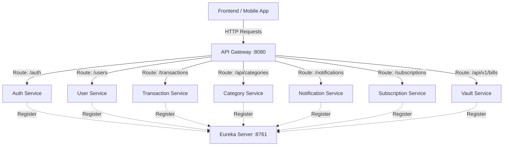
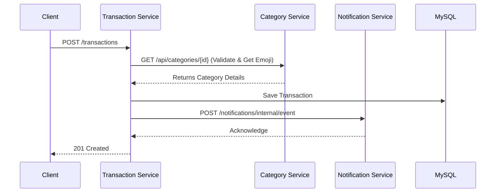
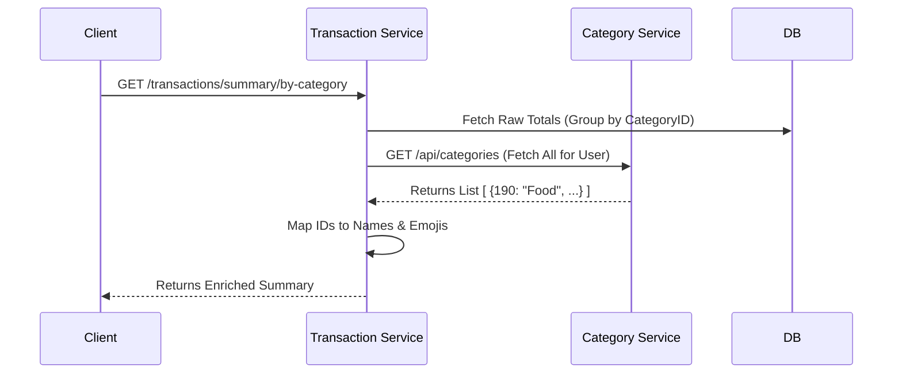
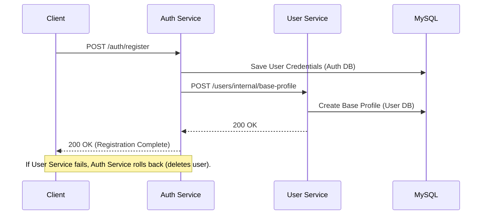

# 📘 Backend Setup & Usage Guide (Frontend Team)

This guide is designed to help frontend developers set up, run, and interact with the Expense Tracker backend locally.

---

## ✅ Prerequisites

Before you begin, ensure you have the following installed:

1.  **Java JDK 17+**: [Download Here](https://www.oracle.com/java/technologies/downloads/)
    *   Verify with: `java -version`
2.  **MySQL Server**: [Download Here](https://dev.mysql.com/downloads/installer/)
    *   Verify you can connect via Workbench or CLI.
3.  **Git**: For cloning the repository.

---

## 🗄️ Database Setup

The backend requires a MySQL database to store data.

1.  Open your MySQL client (Workbench, DBeaver, or Command Line).
2.  Create a new database:
    ```sql
    CREATE DATABASE expense_tracker_dev;
    ```
3.  **Configure Credentials:**
    By default, the services expect the following credentials. You can either create a user to match this OR update the `application.properties` file in each service folder.

    *   **Username:** `root`
    *   **Password:** `your-db-password`
    *   **Host:** `localhost:3306`

---

## 🚀 Running the Backend

The backend consists of multiple "microservices". You need to run them in a specific order for them to talk to each other.

### Option 1: Using Terminals (Recommended)

Open separate terminal tabs/windows for each service and run the following command inside the respective folder:

**Windows (PowerShell/CMD):**
```powershell
.\mvnw spring-boot:run
```

**Mac/Linux:**
```bash
./mvnw spring-boot:run
```

### ⚠️ Startup Order (Crucial)

1.  **`eurekaserver`** (Wait for it to start fully)
    *   *Why?* This is the phonebook. Other services need to register here.
    *   URL: `http://localhost:8761` (Dashboard)
2.  **`apigateway`**
    *   *Why?* This is the front door. You will send all API requests here.
    *   Port: `8080`
3.  **`authservice`**
    *   *Why?* Needed for logging in.
4.  **`UserService`**
5.  **`categoryservice`**
6.  **`transactionservice`**
7.  **`NotificationService`**
8.  **`subscriptionservice`**
9.  **`vaultservice`** (Optional)

---

## 🏗️ System Architecture & Data Flow

The backend follows a **Microservices Architecture**. Services communicate with each other using REST APIs (via Feign Clients).

### 1. High-Level Architecture



### 2. Inter-Service Communication Examples

#### A. Creating a Transaction
When you create a transaction, multiple services work together:



#### B. Generating Summaries
To calculate "Total Spent on Food", the Transaction Service needs category names:



#### C. User Signup Flow (New)
When a user registers, the Auth Service automatically creates a base profile in the User Service.



## ⚙️ Global Configuration

### 1. CORS (Cross-Origin Resource Sharing)
All microservices are configured to allow requests from **any origin (`*`)**.
*   **Allowed Methods:** GET, POST, PUT, DELETE, OPTIONS, PATCH
*   **Allowed Headers:** All (`*`)
*   **Exposed Headers:** `Authorization`

### 2. Standard Error Responses
All API errors follow a standard JSON format:
```json
{
  "status": "error",
  "message": "Category type does not match transaction amount"
}
```

---

## 🔌 API Usage Guide

**Base URL:** `http://localhost:8080`  
(Do not call services directly on their individual ports like 8081, 8082. Always go through 8080).

### 1. Authentication Flow (JWT)

The backend uses **JWT (JSON Web Tokens)**. You cannot access data without a token.

1.  **Register:**
    *   `POST /auth/register`
    *   Body: `{ "name": "John", "email": "john@example.com", "password": "123" }`
2.  **Login:**
    *   `POST /auth/login`
    *   Body: `{ "email": "john@example.com", "password": "123" }`
    *   **Response:** You will get a `token`. **Save this!**
3.  **Authenticated Requests:**
    *   For **ALL** other requests, add this header:
    *   `Authorization: Bearer <YOUR_TOKEN_HERE>`

### 2. Key Endpoints

| Feature | Method | Endpoint | Description |
| :--- | :--- | :--- | :--- |
| **User** | GET | `/users/{id}` | Get user profile |
| **User** | PUT | `/users` | Update profile (DOB, Age, Phone) |
| **Categories** | GET | `/api/categories` | Get all categories for user |
| **Categories** | POST | `/api/categories` | Create custom category |
| **Transactions** | POST | `/transactions` | Create Income/Expense (Strict Validation) |
| **Transactions** | GET | `/transactions/filter?type=EXPENSE` | Get only expenses (Sorted Newest First) |
| **Summary** | GET | `/transactions/summary/by-category` | Get totals grouped by category |
| **Notifications** | GET | `/notifications` | Get user alerts |
| **Bills (Vault)** | POST | `/api/v1/bills/upload` | Upload receipt image (Multipart) |
| **Bills (Vault)** | GET | `/api/v1/bills` | List uploaded bills |
| **Bills (Vault)** | GET | `/api/v1/bills/filter` | Filter bills by `categoryId`, `from`, `to` |

### 3. Transaction Rules & Validation

The Transaction Service enforces strict rules to ensure data integrity:

*   **Income:** Must have a **positive** amount.
*   **Expense:** Must have a **negative** amount (if you send a positive amount for an Expense category, it is automatically converted to negative).
*   **Category Validation:** The system checks if the Category Type matches the amount (e.g., you cannot add a negative amount to an "INCOME" category).
*   **Sorting:** All transaction lists are returned sorted by **Date (Newest First)**.

**Response Example (Enriched Metadata):**
```json
{
    "id": 101,
    "amount": -50.00,
    "description": "Lunch",
    "categoryName": "Food",
    "categoryEmoji": "🍔",
    "categoryType": "EXPENSE",
    "createdAt": "2025-12-02T12:00:00Z"
}
```

### 4. File Uploads (Vault Service)

The **Vault Service** handles file uploads (e.g., receipts, invoices).

*   **Endpoint:** `POST /api/v1/bills/upload`
*   **Content-Type:** `multipart/form-data` (Not JSON)
*   **Form Fields:**
    *   `file`: The file object (Image/PDF).
    *   `billDescription`: Text description (e.g., "Lunch Receipt").
    *   `categoryId`: ID of the category (e.g., `190`).
    *   `date`: (Optional) Date in `YYYY-MM-DD` format. Defaults to today.

> **Note:** Files are stored in AWS S3. If you receive a `403 Forbidden` on download/delete, it means the backend has write-only access to the cloud storage for security.

---

## 🧪 Verification Script

We have included a script that automatically tests the entire flow (Register -> Login -> Create Data -> Check Results).

Run this in PowerShell to verify your local setup is working correctly:

```powershell
.\demo_backend.ps1
```

If this script finishes with "DEMO COMPLETE", your backend is healthy!

---

## ❓ Troubleshooting

*   **"Connection Refused"**: Ensure MySQL is running.
*   **"Service Unavailable" / 503**: The specific service (e.g., Transaction Service) might not be fully started yet, or Eureka hasn't registered it. Wait 30 seconds and try again.
*   **"Unauthorized" / 403**: Check if you are sending the `Authorization: Bearer ...` header correctly.
*   **Currency Symbols look weird**: Ensure your terminal or frontend supports UTF-8 encoding. The backend sends `₹` (Rupee symbol).

---
*Happy Coding!* 🚀
